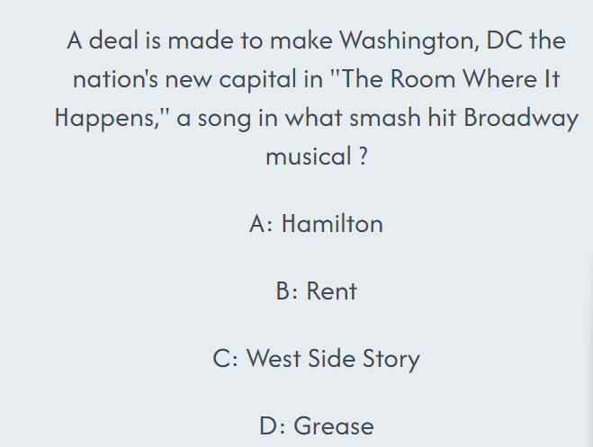
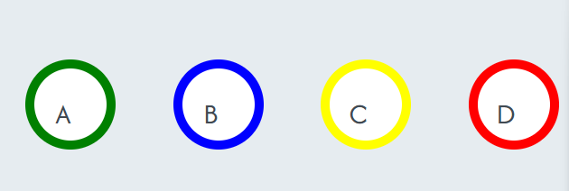

# Musical Quiz

This site has been created as a means of testing users' knowledge on Broadwat and West End Musicals through trivia questions

## Features

\*Navigation

    * The site is simple to navigate, with the questions refreshing after the user has inputted the correct (or incorrect) answer and clicked on the OK button to move onto the next
    * There is a counter to keep track of the number of correct and incorrect answers provided
    * The layout of the navigation is fairly simple and should be easy for users to use
    * The font contrasts the background colour so is easy to read
    * In order to start again, the user simply needs to refresh the page

\*The Header
This section is kept simple as the quiz is interactive, in order to not complicate the code
The head of the HTML code contains the basic instructions and meta tags.

\*The question section
This was fairly difficult to build due to the number of questions required, each had to be targeted by the JavaScript in order for the user to be able to move on to the next question.

\*The answer buttons
These buttons have been created in different colours and are in alphabetical order, to assist visually impaired users. The font is easy to read and is easy to distinguish which button is for which letter.

\*The score
I have included a colour coded score counter, this will keep track of how many questions the user answers correctly and incorrectly. Correct answer scores can be seen in green and incorrect scores in red.

    

## Testing

\*I confirmed that the site works within the IDE and when deployed onto the browser

\*I confirmed that the page is repsonsive and functions on different screen sizes using DevTools device bar

\*I checked that the text is readable across all pages, and that is would be easy for users to understand

\*I have confirmed that the quiz works on each question by inputting the correct and an incorrect answer into each question

## Bugs

\*Upon deployment I noticed a few issues with the title not loading on the browser tab and the buttons had duplicated the letter inside it

## Validator Testing

*HTML
*No errors were found in my html code after passing it through the W3C validator

*CSS
*No errors were found in passing my css code after passing it through the W3C validator

*JavaScript
*No errors were found in passing my code through the official jshint validator

The following metrics were returned:
`There are 7 functions in this file.
Function with the largest signature take 2 arguments, while the median is 0.
Largest function has 12 statements in it, while the median is 5.
The most complex function has a cyclomatic complexity value of 7 while the median is 1.`

*Accessibility
*I confirmed that there was sufficient contrast between the background colour and font colour to make it easy to read
\*I ran the code through lighthouse in devtools

### Unfixed bugs

No unfixed bugs found

## Deployment

*The site was deployed to GitHub pages by:
*Going to the GitHub repository and accessing 'Settings'
\*Selecting the 'Master Branch' in the source section dropdown

The live link - <https://nicolemann98.github.io/musical-quiz/>

## Credits

### Content

\*The questions used for this quiz have been sourced from watercoolertrivia.com

\*Walkthrough for structure for the buttons and basic style rules from <https://github.com/Code-Institute-Solutions/love-maths-2.0-sourcecode/tree/master/05-tidying-up/01-a-few-last-things>

### Media

\*All images were taken from Pexels - <https://www.pexels.com/>
